### Как приступить к выполнению задания:

Установить на свой компьютер **PostgreSQL 16** (желательно одну из последних версий - 16.6 / 16.7)
Запустите скрипты из параграфа "Скрипт для генерации базы"
После этого приступайте к задачам
Задачи
Важно: предоставить доказательства для задач 1-4 в виде плана запроса со статистикой выполнения.

[1] ускорить простой запроc, добиться времени выполнения < 10ms
select name from t1 where id = 50000;
postgres=# EXPLAIN ANALYZE 
postgres-# Select name from t1 where id = 50000;
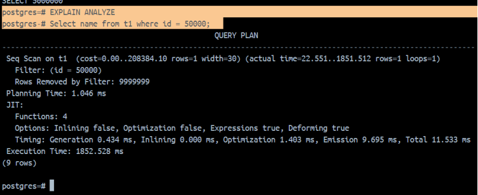
Запрос выполнился за 1852ms, т.к. оптимизатор выбрал план полного сканирования таблицы. 
```
CREATE INDEX index_btree_t1 ON t1 USING BTREE(id);
EXPLAIN ANALYZE
SELECT name FROM t1 WHERE id = 50000;
```
Запрос выполнился за 0.238ms потому, что исползовался покрывающий индекс к таблице t1  по полю id.

[2] ускорить запрос "max + left join", добиться времени выполнения < 10ms
select max(t2.day) from t2 left join t1 on t2.t_id = t1.id and t1.name like 'a%';
1 способ решения:
```
CREATE INDEX btree_t1_name ON t1 USING BTREE(name);
CREATE INDEX btree_t2_day ON t1 USING BTREE(name);
```
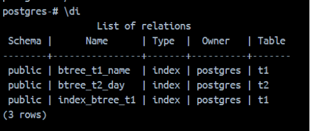
```
explain analyze select t2.day from t2 left join t1 on t2.t_id = t1.id 
where t1.name like 'a%' ORDER BY t2.day DESC LIMIT 1;
```
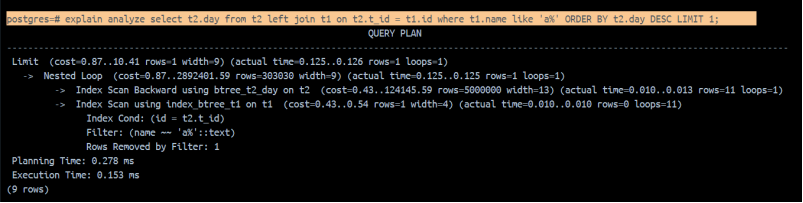
2-й способ решения:
Если в задаче поменять букву a в фильтре LIKE 'a%' на другую букву, то первый способ решения не сработает по заданному времени. Поэтому создаю индексы на id таблиц, чтобы укорить соединение таблиц в запросе.
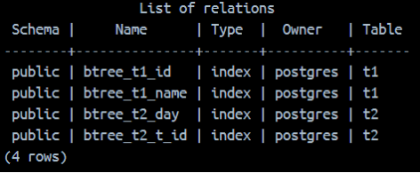
```
SELECT max(t2.day)
FROM t2
LEFT JOIN t1 
ON t2.t_id = t1.id
AND t1.name LIKE  'a%';
```
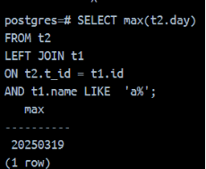
```
EXPLAIN ANALYZE
SELECT max(t2.day)
FROM t2
LEFT JOIN t1 
ON t2.t_id = t1.id
AND t1.name LIKE  'a%';
```
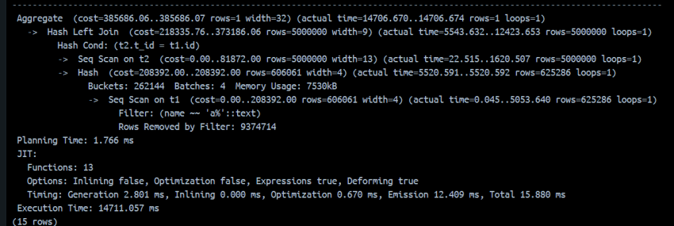
На выполнение агрегированной функции max(t2.day)потребовалось14706 ms.
Поэтому, выполняю фильтрацию по условию в блоке WITH, потом сортирую и беру первое значение:
```
WITH name_x AS(
SELECT id
FROM t1
WHERE name LIKE 'a0001%' )

SELECT t2.day
FROM t2
LEFT JOIN name_x 
ON  name_x.id = t2.t_id
ORDER BY t2.day
LIMIT 1;
```
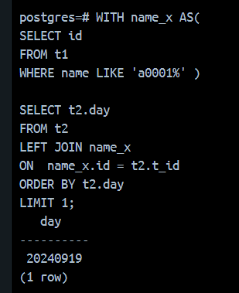
```
EXPLAIN ANALYZE
WITH name_x AS(
SELECT id
FROM t1
WHERE name LIKE 'a0001%' )

SELECT t2.day
FROM t2
LEFT JOIN name_x 
ON  name_x.id = t2.t_id
ORDER BY t2.day
LIMIT 1;
```
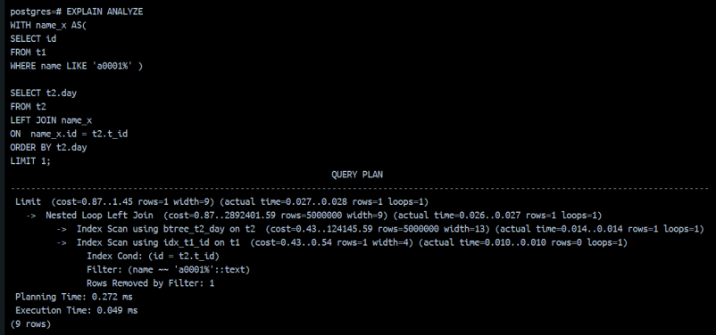

[3]ускорить запрос "anti-join", добиться времени выполнения < 10sec
select day from t2 where t_id not in ( select t1.id from t1 );
Запрос "anti-join"предусматривает поиск такиx записей в таблице t2, для которых нет соответствующих записей в t1. Проверяю таблицу t1 на наличие null значений в поле name.
```
SELECT day 
FROM t2
WHERE NOT EXISTS
(SELECT * 
FROM t1 
WHERE t2.t_id = t1.id );
```
Этот запрос вернет все записи t2, для которых нет соответствующих по t_id записей в t1 c t1.id.
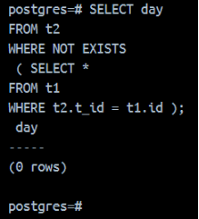


```
EXPLAIN ANALYZE
WITH current AS(
SELECT id
FROM t1)
SELECT t2.t_id
FROM t2
LEFT JOIN current
ON t2.t_id = current.id
AND current.id IS NULL;
```
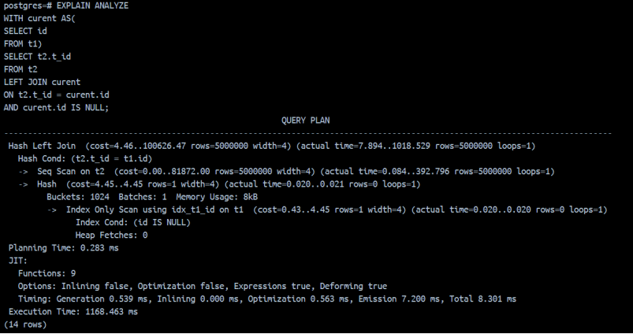
Использую оконную функцию rank(), чтобы ранжировать строки с сортировкой по условию t1.name так, чтобы на первом месте в списке стояли null:
```
SELECT t1.name, t2.day,
rank() OVER (ORDER BY t1.name nulls first)
FROM t1
LEFT JOIN t2
ON t1.id = t2.t_id
WHERE t1.name is NULL;
```
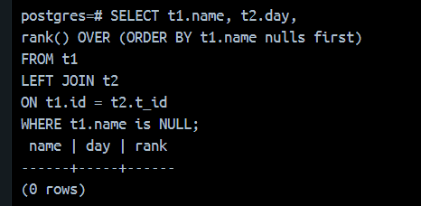
```
EXPLAIN ANALYZE
SELECT t1.name, t2.day,
rank() OVER (ORDER BY t1.name nulls first)
FROM t1
LEFT JOIN t2
ON t1.id = t2.t_id
WHERE t1.name is NULL;
```

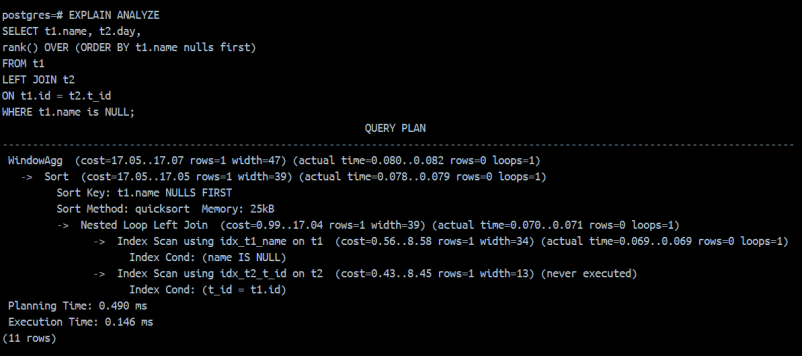

[4] ускорить запрос "semi-join", добиться времени выполнения < 10sec

select day from t2 where t_id in ( select t1.id from t1 where t2.t_id = t1.id) and day > to_char(date_trunc('day',now()- '1 months'::interval),'yyyymmdd');
По запросу надо найти записи из таблицы t2, которые имеют соответствующие им записи в таблице t1 и дата должна удовлетворять условию в запросе; от текущей даты вычисляется дата, месяцем назад и представляется в формате: годмесяцдень.

```
WITH current_t2 AS (
SELECT t2.day, t2.t_id 
FROM t2 
WHERE t2.day > to_char( date_trunc('day', now() - '1 months'::interval), 'yyyymmdd') )
SELECT cur.day 
FROM current_t2 cur 
JOIN t1 ON cur.t_id = t1.id;
```

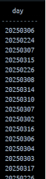

```
EXPLAIN ANALYZE
WITH current_t2 AS (
SELECT t2.day, t2.t_id 
FROM t2 
WHERE t2.day > to_char( date_trunc('day', now() - '1 months'::interval), 'yyyymmdd') )
SELECT cur.day 
FROM current_t2 cur 
JOIN t1 ON cur.t_id = t1.id;
```

Больше всего потрачено времени на Hash Join 8168ms.
Увеличила рабочую память, чтобы поместились таблицы в оперативную память.

```
SET work_mem = '1024MB';
```

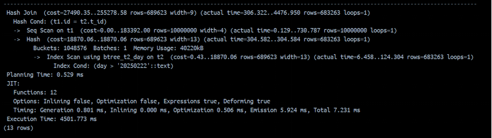
Возможно, что создание материализованного представления, где будет храниться информация, к которой буду обращаться из запроса решит проблему ускорения запроса:

```
CREATE MATERIALIZED VIEW mv_t2 AS
SELECT t2.day 
FROM t2 
JOIN t1 ON t2.t_id = t1.id 
WHERE t2.day > '20250222';
EXPLAIN ANALYZE
SELECT * FROM mv_t2;
```

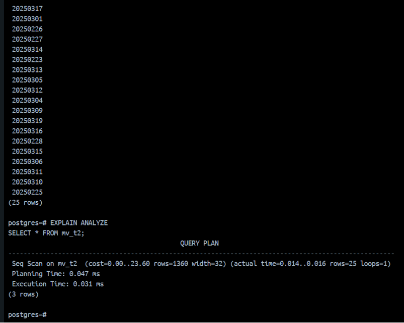


[5] ускорить работу "savepoint + update", добиться постоянной во времени производительности (число транзакций в секунду);

 


